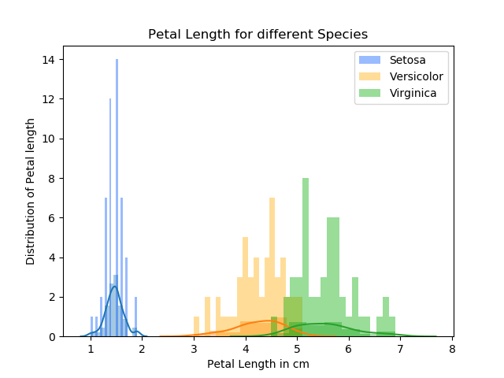

# pands-project
Submit Project to GMIT
Research and Investigation of the "Fisher Iris Data Set"
---

## Analsye the "Fisher's Iris Data Set"
### Project Description
The Iris flower data set is a multivariate data set from by the British and biologist Ronald Fisher. The Data set was produced in 1936. The data set examine three types of Iris flowers Iris setosa, Iris versicolor and Iris virginica. In the data set four variables Sepal length, Sepal width, Petal length and Petal width will be examined.

### Analysis
The best way to classify the three types of Iris flowers is by looking at the plots and the “Projectsummery.txt” file for each variable (Sepal length, Sepal width, Petal length, Petal width).
By looking at the histogram for the petal length and petal width we can see a separation between Iris flower Setosa and the other two Iris Flowers Versicolor and Virginica. The Iris Flower Setosa has the shortest Petal length and Petal width. Setosa has a Petal length below of 2 with a majority of flowers have a Petal length of 1.5. To distinguish between Versicolor and Virginica is more difficult because it is more overlap between the two flowers. 

## References 

### Wikipedia website
[Iris Flower Data Set](https://en.wikipedia.org/wiki/Iris_flower_data_set"To the site)

### Iris Data Set CSV file download
[Download](https://raw.githubusercontent.com/uiuc-cse/data-fa14/gh-pages/data/iris.csv"To Download)

