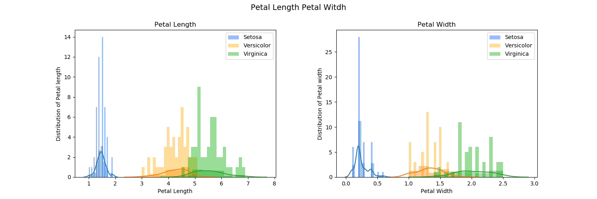
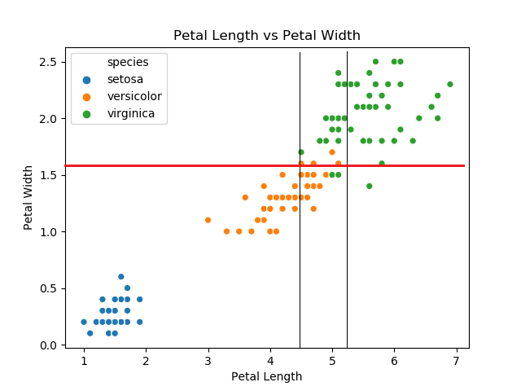

# pands-project
Submit Project to GMIT
Research and Investigation of the "Fisher Iris Data Set"
---

## Analsye the "Fisher's Iris Data Set"
### Project Description
The Iris flower data set is a multivariate data set from the British biologist Ronald Fisher. The Data set was produced in 1936. The data set consist 50 samples for each of the three types of Iris flowers Iris Setosa, Iris Versicolor and Iris Virginica. In the data set four features Sepal length, Sepal width, Petal length and Petal width will be examined for each species. 

### Project Objective
The objective in this project is to classify a given Iris flower into the three species Iris Setosa, Iris Versicolor and Iris Virginica.

### Project Procedure
Using Python as a tool for investigating the Iris flower data set.
1. Import Python Libraries in the project
    - import pandas as pd
    - import matplotlib.pyplot as plt
    - import seaborn as sns

2. Download the Iris data set from the Internet
    - [Download](https://raw.githubusercontent.com/uiuc-cse/data-fa14/gh-pages/data/iris.csv"To Download)

3. Save the data set to a csv file "Fishers_Iris_Dataset.csv"
4. Save the data set to a text File "Fishers_Iris_Dataset.txt"
5. Split the data set in to the three species
6. Plot four features for each species in to Histograms
7. Plot the four features for each species in to Scatter plots
8. Save the statistical sumery for each species in to a text file "Projectsummery.txt"

### Analytics
The best way to classify the three types of Iris flowers is by looking at the plots and the “Projectsummery.txt” file for each variable (Sepal length, Sepal width, Petal length, Petal width).
By looking at the histogram for the petal length and petal width we can see a separation between Iris flower Setosa and the other two Iris Flowers Versicolor and Virginica. The Iris Flower Setosa has the shortest Petal length and Petal width. Setosa has a Petal length below 2 with a majority of flowers have a Petal length of 1.5. To distinguish between Versicolor and Virginica is more difficult because it has some overlaps between the two flowers. If the Petal length is over 5.2 it can be assumed it will be Virginica. When the Petal length is below 4.5 the flower will be Versicolor. A Petal length between 4.5 and 5.2 it can be either Versicolor or Virginica. 

To distinguish between Iris flower Versicolor and Virginica we can use the scatter plot “Petal Length vs Petal Width”. Looking at the values on the scatter plot for the Petal Length between the 4.5 and 5.2 we can narrow the investigation. If the Petal width is greater then 1.6 it is to 92% the Iris flower Virginica. If the Petal width is smaller then 1.6 it is to 94% the Iris flower Verisolor. 

### Advantage of Python verses Excel,
Python doesn’t require any software license fees. It can run on Windows as well as on Linux based operation systems. Python can run on embedded systems or on small computers like the Raspberry Pi. For data analytics with Python they are plenty of open source libraries available. If you have a good understanding of Python it can be used for cloud computing, artificial intelligence application (AI), Internet of the things (IoT) as well in the industry. 

## References 
### Analyse References
Project Reference   
[Analytics](https://medium.com/analytics-vidhya/exploratory-data-analysis-uni-variate-analysis-of-iris-data-set-690c87a5cd40"To the site")

Wikipedia website   
[Iris Flower Data Set](https://en.wikipedia.org/wiki/Iris_flower_data_set"To the site)

Iris Data Set CSV file download  
[Download](https://raw.githubusercontent.com/uiuc-cse/data-fa14/gh-pages/data/iris.csv"To Download)

